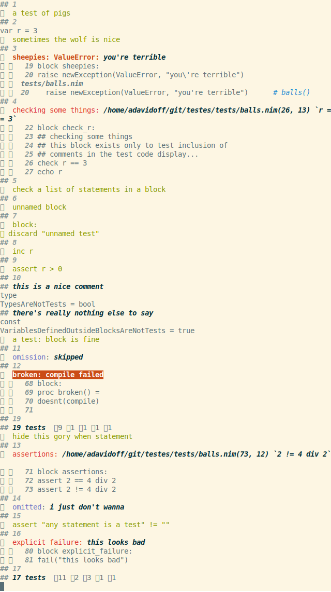

# testes

[](https://github.com/disruptek/testes/actions?query=workflow%3ACI)
[](https://github.com/disruptek/testes/releases/latest)

[](#license)
[](https://www.buymeacoffee.com/disruptek)

A small unittest macro with some features I needed.

## Why

Because `testament` and `testutils` are going nowhere fast.

## Goals

- expect everything to work; any statement is a test
- show the test code as we run it, unless not :wink:
- better stack traces and test source output
- less magical syntax and less output omission
- aim to run many cheap tests in fewer files
- easily accumulate state between tests when desired
- when attached to a tty, errors are not fatal
- individual tests don't even have to compile
- easier test reordering, built-in timing, mem stats
- smaller, more self-evident testing macro

## Notable Mentions

- With `--define:release`, _all code_ **must** compile.

## Usage

Here's a set of example tests which will pass (and fail) in interesting ways.

```nim
import testes

testes:

  block goats:
    ## this is a test of goats
    discard

  block pigs:
    ## a test of pigs
    discard

  var r = 3

  block sometimes_the_wolf_is_nice:
    assert true
    inc r

  block sheepies:
    raise newException(ValueError, "you're terrible")

  block check_r:
    ## checking some things
    ## this block exists only to test inclusion of
    ## comments in the test code display...
    check r == 3
    echo r

  block:
    ## unnamed block
    discard

  block:
    discard "unnamed test"

  inc r
  assert r > 0
  type TypesAreNotTests = bool
  const VariablesDefinedOutsideBlocksAreNotTests = true

  test "a test: block is fine":
    discard

  block omission:
    skip()

  block:
    ## hide this gory when statement
    when defined(release):
      testes:
        const compile = true
        proc doesnt(c: bool) =
          if not c:
            raise

        block:
          proc fixed() = doesnt(compile)
    else:
      testes:
        block:
          proc broken() = doesnt(compile)

  block assertions:
    assert 2 == 4 div 2
    assert 2 != 4 div 2

  assert "any statement is a test" != ""
  check r > 0, $r & " is a good test of dynamic messages"

  block explicit_failure:
    fail("this looks bad")

  block check_with_message:
    let x = 0
    check "".len < x, "empty strings are STILL too long"
```

Relax; your tests won't usually be this chaotic...  Right?  😉



Here's a similar demo with `--define:danger` enabled to show the
performance metrics; no failing tests are permitted in such a build.


## Documentation
See [the documentation for the testes module](https://disruptek.github.io/testes/testes.html) as generated directly from the source.

## License
MIT
