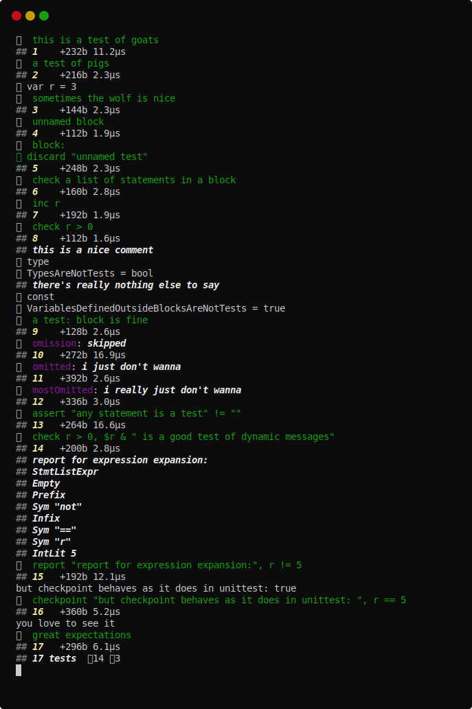

# balls

[](https://github.com/disruptek/balls/actions?query=workflow%3ACI)
[](https://github.com/disruptek/balls/releases/latest)

[](#license)
[](https://www.buymeacoffee.com/disruptek)

A unittest macro to save the world, or at least your Sunday.

## Why?

There's a want to centralize and reuse the logic that determines what code is
deemed successful and how we go about measuring this.

## Goals

- expect everything to work; any statement is a test
- show the test code as we run it, unless not :wink:
- better stack traces and test source output
- less magical syntax and less output omission
- aim to run many cheap tests in fewer files
- easily accumulate state between tests when desired
- when attached to a tty, errors are not fatal
- individual tests don't even have to compile
- easier test reordering, built-in timing, mem stats
- smaller, more self-evident testing macro
- no options means, "what would disruptek do?"

## FAQ

If you're wondering why you cannot see compiler error messages for a particular
test that fails to compile, note that we use `compiles()` to swallow errors and
allow subsequent tests to get executed, but only outside of `--define:release`.

- With `--define:release`, compiler errors are fatal and output to console.
- With `--define:ballsDry`, no color or emojis are output.

## Test Runner Usage

You can now run `balls` to run a limited local test matrix against the current
compiler -- the matrix is expanded automatically on GitHub Actions CI. This
runtime will try to guess how to test your project regardless of its structure, but you can help narrow what it chooses to compile by...

- placing files matching `t*.nim` under a `tests` subdirectory, or
- having a single file `foo.nim` in your `foo` project, or
- TBD


You can add arguments which will be passed directly to the compiler:

```
$ balls --styleCheck:error
# ... all tests are compiled with --styleCheck:error ...
```

## Test Library Usage

Here's a set of example tests which will pass (and fail) in interesting ways.

```nim
import balls

suite "suite balls":

  block goats:
    ## this is a test of goats
    discard

  block pigs:
    ## a test of pigs
    discard

  var r = 3

  block sometimes_the_wolf_is_nice:
    assert true
    check true, "that wolf is very nice"
    inc r

  block sheepies:
    raise newException(ValueError, "you're terrible")

  block check_r:
    ## checking some things
    ## this block exists only to test inclusion of
    ## comments in the test code display...
    check r == 3
    echo r, " will not be output"

  block:
    ## check a list of statements in a block
    check "r should be 4":
      r < 5
      r > 3

  block:
    ## unnamed block
    discard

  block:
    discard "unnamed test"

  inc r
  assert r > 0
  ## this is a nice comment
  type TypesAreNotTests = bool
  ## there's really nothing else to say
  const VariablesDefinedOutsideBlocksAreNotTests = true

  test "a test: block is fine":
    discard

  block omission:
    skip()

  block:
    ## hide this gory when statement
    when defined(release):
      suite "fixed stuff":
        const compile = true
        proc doesnt(c: bool) =
          if not c:
            raise

        block:
          proc fixed() = doesnt(compile)
    else:
      suite "broken stuff":
        block:
          proc broken() = doesnt(compile)

  block assertions:
    assert 2 == 4 div 2
    assert 2 != 4 div 2

  block omitted:
    skip("i just don't wanna")

  assert "any statement is a test" != ""
  check r > 0, $r & " is a good test of dynamic messages"

  report "report for expression expansion:", r != 5
  checkpoint "but checkpoint behaves as it does in unittest: ", r == 5

  block explicit_failure:
    fail("this looks bad")

  block check_with_message:
    let x = 0
    check "".len < x, "empty strings are STILL too long"

  block great_expectations:
    expect ValueError:
      checkpoint "you love to see it"
      raise newException(ValueError, "awful")

  block unmet_expectations:
    expect ValueError:
      checkpoint "here comes trouble"

  block dashed_expectations:
    expect ValueError:
      check false, "the truth hurts, but not as much as the false"
```

Relax; your tests won't usually be this chaotic...  Right?  😉


Here's a similar demo with `--define:danger` enabled to show the
performance metrics; no failing tests are permitted in such a build.



## Documentation
See [the documentation for the balls module](https://disruptek.github.io/balls/balls.html) as generated directly from the source.

## License
MIT
